# ⚛️ A Preliminary Exploration of the Muon Optimizer

<div align="center">

**CS5489 Course Project**

[](https://www.python.org/)
[](https://pytorch.org/)
[](LICENSE)

</div>

## 📖 Introduction
**Muon** (MomentUm Orthogonalized by Newton-schulz) is a novel optimizer designed to improve training efficiency for neural networks. In this project, we explore the capabilities of Muon by comparing it against standard optimizers (SGD and AdamW) across three distinct domains:

1.  **Image Classification:** CIFAR-10 benchmarks.
2.  **Neural Implicits:** 2D Score Distillation Sampling (SDS).
3.  **LLM Pretraining:** Auto-regressive training on FineWeb.

---

## 🖼️ Experiment 1: Image Classification
*Benchmarking convergence speed on standard vision datasets.*

### 🛠️ Installation
First, set up the CIFAR-10 environment:

```bash
cd cifar10-airbench
conda env create -f environment.yml
conda activate cifar10
````

### 🚀 Training

The CIFAR-10 dataset will be automatically downloaded during the first run.

**Run Muon:**

```bash
python airbench94_muon.py
```

**Run AdamW:**

```bash
python airbench94_adamw.py
```

### 📊 Results

Training logs (`.pt` files) are saved in `/cifar10-airbench/logs`. You can visualize them using `read_pt.py`.

**Convergence Comparison (7 Epochs):**

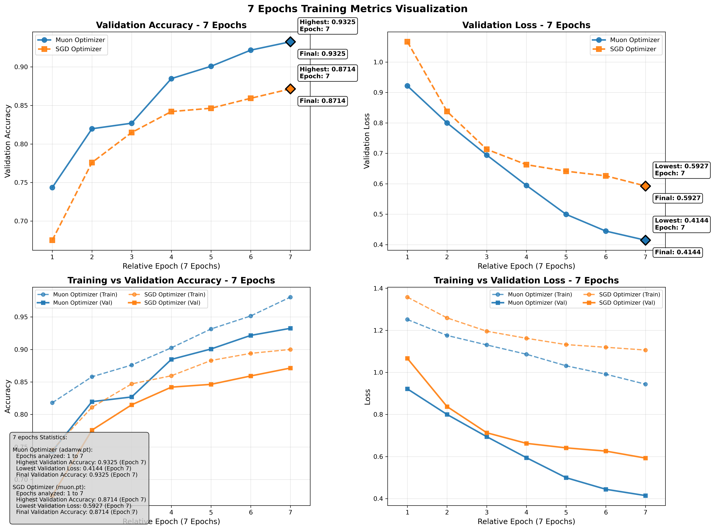

-----

## 🧠 Experiment 2: Neural Implicits (2D)

*Testing optimization stability in Score Distillation Sampling.*

### ⚙️ Prerequisites

  * **Hardware:** NVIDIA GPU with CUDA 11.8+ installed.
  * **System:** Python 3.8+ (Conda recommended).

### 🛠️ Environment Setup

We offer a streamlined installation adapted from Nerfstudio.

```bash
conda create --name bridge -y python=3.8
conda activate bridge
pip install --upgrade pip

# Install PyTorch with CUDA 11.8 support
pip install torch==2.1.2+cu118 torchvision==0.16.2+cu118 --extra-index-url [https://download.pytorch.org/whl/cu118](https://download.pytorch.org/whl/cu118)

# Install dependencies
cd 2D_experiments
pip install -r requirements.txt
```

### 🚀 Run 2D Optimization

Navigate to the neural implicit directory:

```bash
cd 02_NEURAL-IMPLICIT
```

**Generate results:**

```bash
python generate.py
# Or run the batch script
bash run.sh
```

**Customization Options (`generate.py`):**

  * `--mode`: Loss function (e.g., `bridge`, `sds`, `nfsd`, `vsd`).
  * `--seed`: Random seed.
  * `--lr`: Learning rate.
  * `--cfg_scale`: Classifier-free guidance scale.

### 📊 Visual Results

#### 1\. Optimizer Comparison

*Generating assets from text prompts.*

| Prompt | "a DSLR photo of a cat" | "a knight riding a horse" | "a paper boat on the ocean" |
| :--- | :---: | :---: | :---: |
| **AdamW** | 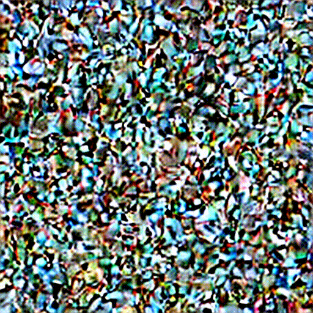 | 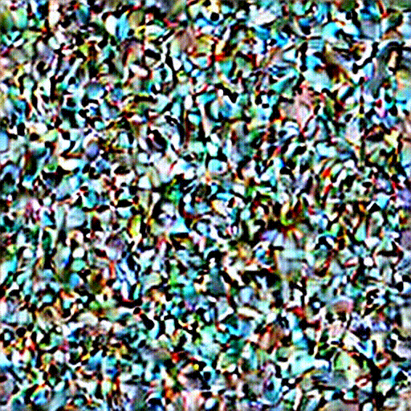 | 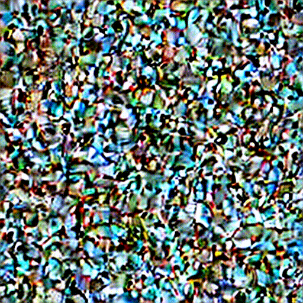 |
| **Muon** |   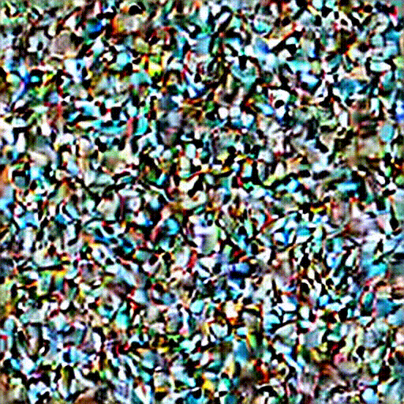 |  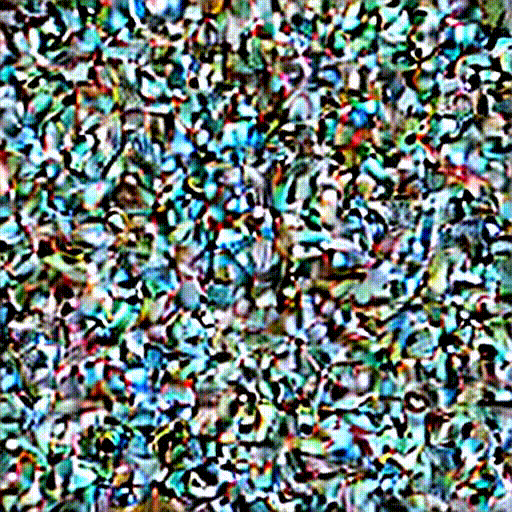 |  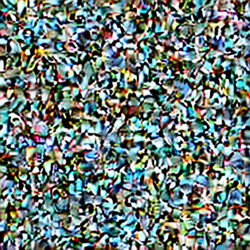 |

#### 2\. Learning Rate Sensitivity

*Comparison of generation quality at different learning rates (LR).*

| LR = 1.0 | LR = 75.0 | LR = 200.0 |
| :---: | :---: | :---: |
| 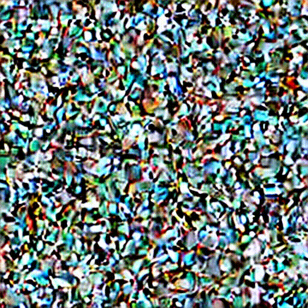 | 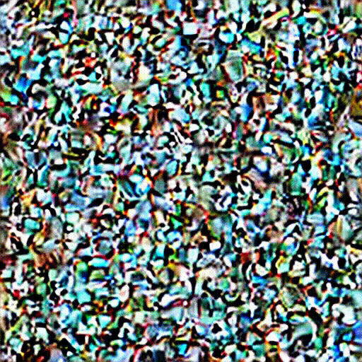 | 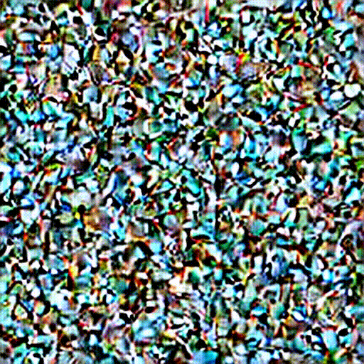 |

-----

## 📉 Experiment 3: Auto-regressive Pretraining

*Large-scale language model training (NanoGPT) on FineWeb.*

### 🛠️ Installation

```bash
cd modded-nanogpt
conda env create -f environment.yml
conda activate modded
```

### 📂 Dataset Preparation

Download the first 900M training tokens of FineWeb-10B (optimized for quick experimentation):

```bash
python data/cached_fineweb10B.py 9
```

### 🚀 Training

We use `torchrun` for distributed training simulation. You can modify `run.sh` or run the commands directly.

**Run Muon:**

```bash
export CUDA_VISIBLE_DEVICES=0,1,2,3
torchrun --standalone --nproc_per_node=4 train_gpt_muon.py
```

**Run AdamW:**

```bash
export CUDA_VISIBLE_DEVICES=0,1,2,3
torchrun --standalone --nproc_per_node=4 train_gpt_adamw.py
```

### 📊 Results

Logs are generated in `/modded-nanogpt/logs`.

**Validation Loss (Perplexity):**

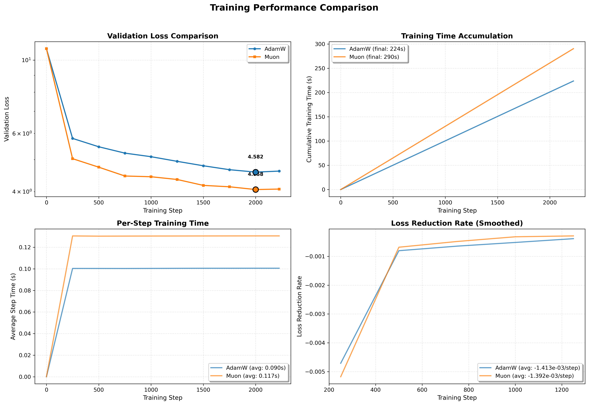

-----

## 📝 Citation

This project is based on the Muon optimizer. If you find this useful, please cite the original work:

```bibtex
@misc{jordan2024muon,
  author       = {Keller Jordan and Yuchen Jin and Vlado Boza and Jiacheng You and
                  Franz Cesista and Laker Newhouse and Jeremy Bernstein},
  title        = {Muon: An optimizer for hidden layers in neural networks},
  year         = {2024},
  url          = {[https://kellerjordan.github.io/posts/muon/](https://kellerjordan.github.io/posts/muon/)}
}
```
